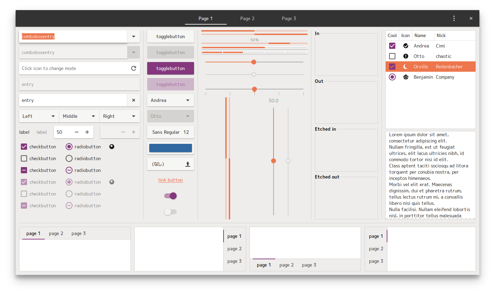
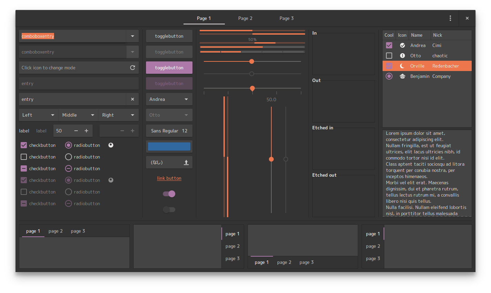
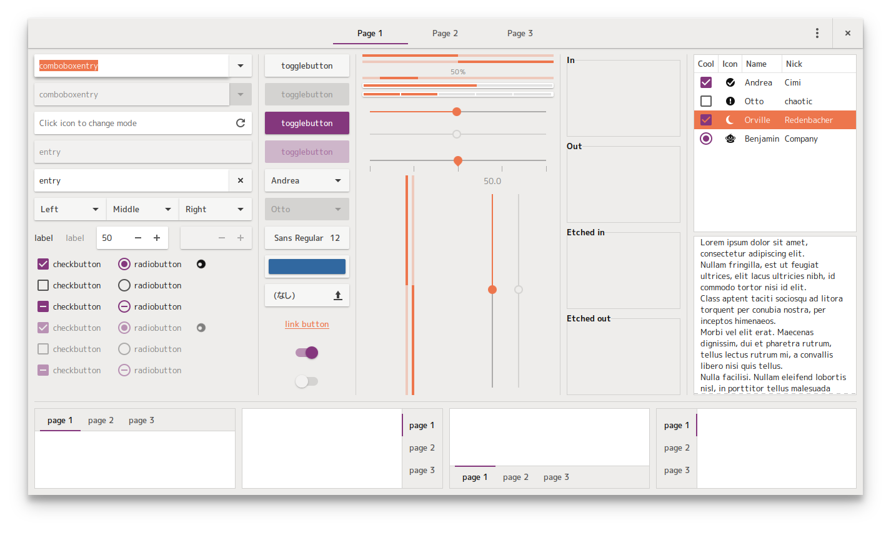

# Material Ubuntu (draft name)

This is a soft fork of [Materia](https://github.com/nana-4/materia-theme) using [Ubuntu colour palette](https://design.ubuntu.com/brand/colour-palette/).





## Differences from Materia

- Most colours are based on the [Ubuntu colour palette](https://design.ubuntu.com/brand/colour-palette/).

## Installation

Run:

```bash
sudo ./install.sh
```

## TODO & Known Issues

NOTE: Please do not report bugs that occur even with Materia. Please report them to [Materia's Issue Tracker](https://github.com/nana-4/materia-theme/issues).

## License

GPLv2+
